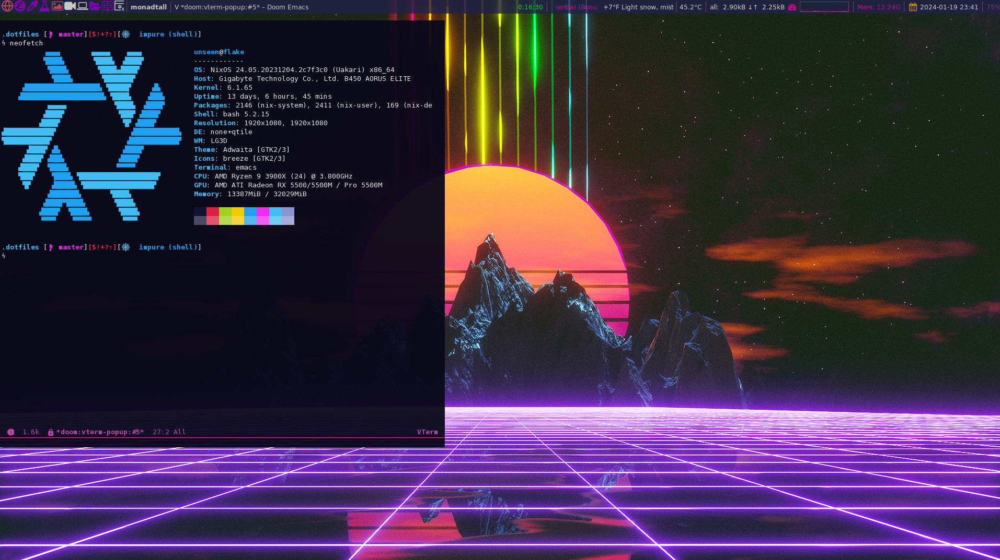

#+TITLE: Readme

* Agent instructions
Before editing this repository, read [[./AGENTS.md][AGENTS.md]] and follow it as the repository editing contract.

In particular, keep literate Org sources and their tangled/generated outputs synchronized, and update the relevant documentation in the same change whenever behavior, architecture, ownership, deployment, interfaces, workflows, host/profile names, or important invariants change.

* Index
+ [[./docs/wiki/index.org][Dotfiles wiki]]
+ [[./docs/wiki/nix.org::*AI client modules and Outrun theme][OpenCode, Codex, and ChatGPT Desktop modules]]
+ [[./docs/wiki/nix.org::*Global Prolog verification][Global Prolog verification policy and hooks]]
+ [[./AGENTS.md][Agent instructions]]
+ [[./bash.org][Bash]]
+ [[./.doom.d/config.org][Desktop Emacs config]]
+ [[./emacs/profiles.org][Emacs profile switcher]]
+ [[./bootstrap-termux.org][Termux bootstrap]]
+ [[./scripts/termux-remote.org][Termux remote desktop workflows]]
+ [[./android/config.org][Native Android Org/Vim config]]
+ [[./android/doom/config.org][Termux Doom config]]
+ [[./android/README.org][Android Emacs profiles]]
+ [[./.config/qtile/qtile-ai.org][Qtile literate config]]
+ [[./.config/qtile/qtile.org][Qtile runtime notes]]
+ [[./.config/dunst/dunst.org][Dunst Config]]
+ [[./tasks.org][Todo List]]

#+OWNLOADED: screenshot @ 2024-01-19 23:41:49

#+CAPTION: My desktop

* Setup
** Dependencies
If you want everything to work out of the box, i highly recommend nixos.
My shell is bash.
Otherwise
+ nix
+ git
+ direnv
+ starship
+ curl

** Install dotfiles
Clone the repo to =~/.dotfiles= and run GNU Stow from the checkout.

** Android / Termux
Android has a Doom-free, Org-first native Emacs profile and a separate full Doom
profile for Termux development.  The native profile uses Evil/Vim bindings,
=org-modern=, native touch behavior, and an Org-centric bottom toolbar.  The
Doom profiles keep the existing desktop/Termux feature set intact.

For a fresh Termux install:

#+begin_src sh
curl -fsSL https://raw.githubusercontent.com/lost-rob0t/dotfiles/master/bootstrap-termux.sh | bash
#+end_src

The bootstrap performs a full Termux upgrade and installs Git, GNU Stow, Emacs,
SWI-Prolog, SBCL on supported 64-bit Android architectures, Nim, Python, the
full Termux Doom profile, OpenCode through a PRoot guest, and Termux:Widget
shortcuts.

Useful entry points after installation:

#+begin_src sh
platform-enter --info
emacs-org                 # Doom-free Org/Vim profile
emacs-termux              # full Termux Doom
android-emacs-stow        # install the native ~/.emacs.d wrapper
doom-termux sync
git --version
ai
#+end_src

Chemacs/profile users can select explicitly:

#+begin_src sh
emacs --with-profile android
emacs --with-profile org
emacs --with-profile doomemacs
emacs --with-profile termux-doom
emacs --with-profile temple
#+end_src

The paired Android build workflow builds GNU Emacs for the =com.termux= shared
user and packages current Termux, Termux:API, and Termux:Widget APKs re-signed
with the same compatibility key.  That lets native Emacs execute the Termux Git
installation via =PATH= without setting =LD_LIBRARY_PATH=.  See
[[./android/README.org][android/README.org]] for the signature/install caveat and
release bundle layout.

The remote desktop helpers and extra Termux widgets are maintained in [[./scripts/termux-remote.org][scripts/termux-remote.org]].  They add fast SSH recovery for the =flake= desktop, remote ChatGPT startup under tmux, Org capture, an Agent Zero local-forward widget, and a visible dotfiles sync shortcut.

Install or refresh them after pulling the repository:

#+begin_src sh
pkg install tmux
git -C ~/.dotfiles pull --ff-only
bash ~/.dotfiles/scripts/install-termux-widgets
#+end_src

The two remote commands are also usable directly after installation:

#+begin_src sh
remote-gui-launch flake chatgpt.desktop chatgpt
agent-zero-tunnel flake 50080
#+end_src

The Agent Zero tunnel forwards the remote loopback service to =http://127.0.0.1:50080= on the phone.  Both remote workflows use five-second SSH keepalives by default and remain configurable through the environment variables documented in the literate source.

The canonical Android sources are [[./android/config.org][android/config.org]],
[[./emacs/profiles.org][emacs/profiles.org]],
[[./bootstrap-termux.org][bootstrap-termux.org]], and
[[./android/doom/config.org][android/doom/config.org]].

** GPT TODO sync
The durable task-state checkout defaults to =~/Documents/gpt-todos= and only its
=agenda/*.org= files are mirrored into =~/Documents/Notes/org/agenda=.

After the dotfiles checkout exists, this one-liner updates dotfiles, performs an
initial sync, and installs the five-minute cron entry:

#+begin_src sh
git -C ~/.dotfiles pull --ff-only && bash ~/.dotfiles/scripts/gpt-todos-sync --deploy 5
#+end_src

The dotfiles-owned deployment command by itself is:

#+begin_src sh
bash ~/.dotfiles/scripts/gpt-todos-sync --deploy 5
#+end_src

** nix
*** Setup nix
Install nix: https://nixos.org/download

#+begin_src shell
nix-channel --add https://github.com/nix-community/home-manager/archive/master.tar.gz home-manager
nix-channel --update
nix-shell '<home-manager>' -A install
home-manager switch --flake github:lost-rob0t/dotfiles#unseen@flake
#+end_src
you might need to update the username to match yours.

To update the home-manager install just run

#+Name: Update home-manager
#+begin_src shell :async :results output replace
home-manager switch --flake github:lost-rob0t/dotfiles#unseen@flake
#+end_src

Since you will be using this with your username, you will need to edit the username.

#+Name: update
#+begin_src shell :async :results output replace

#+end_src
